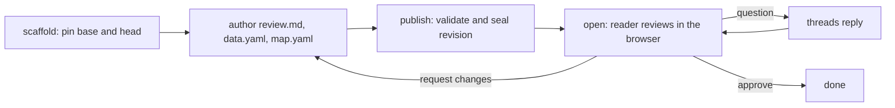

# thurview

There are three kinds of document, and the first decision is which one the
request asks for.

- A **review** explains a CHANGE: a branch, a pull request, a commit range. It
  has a diff, commits and an interface delta, and the reader approves it or
  sends it back. Everything below describes it.
- A **code explainer** explains a CODEBASE, or one subsystem, at a single
  pinned commit, so the reader can see the architecture well enough to spot
  design problems themselves. It has no diff and nothing to approve, and it
  states what it did not examine. It is a separate skill —
  `thurview-explain`, installed beside this one; run `thurview skill` for its
  path. Stop here and read that instead.
- A **design** explains a change that is NOT WRITTEN YET: a design, an
  architecture proposal, an implementation plan. It is pinned to the one commit
  it argues from, its anchors are the code as it stands, and what it would
  build is declared as a proposal attached to the code that proposal lands in.
  It is a separate skill — `thurview-design`, installed beside this one; run
  `thurview skill` for its path. Stop here and read that instead.

Reviewing a change and fixing what the review finds - and posting what stays
unfixed to a pull or merge request - is the `thurview-fix` skill, not this one.
This skill's document is read in the browser.

The agent studies the change and writes a short document in which every claim
about code is anchored to an exact file and line range at a pinned commit.
thurview validates those anchors, seals a revision, and serves it in the
browser with live code peeks, diffs, diagrams and a map. The reader asks
questions, leaves anchored comments, and approves or requests changes. The
agent answers, updates, republishes.



Run the CLI as `thurview`. When it is not on PATH, `npx -y thurview` runs
the published package with the same commands; substitute it everywhere below.
If a command answers `unknown command` or `unknown flag` for something this
skill tells you to run, the installed CLI is older than the skill: run
`thurview update` and retry once, then report the mismatch if it persists.

Every command prints TOON on stdout: the result, then `help[]` with the next
commands. Errors are structured on stdout too (`error`, `code`, `help`); exit
code 1 is a failure, 2 a usage error such as an unknown flag. Progress goes to
stderr; do not scrape it. `thurview` alone shows the reviews of the current
directory; `thurview <command> --help` shows flags and examples.

## Request

$ARGUMENTS

Empty: a review of the current branch against its up-to-date trunk. A PR
number or URL: that pull request. `--base`/`--head`: that range. A request to
explain the codebase, a subsystem or its architecture rather than a change: a
code explainer, per the `thurview-explain` skill. A request for how something
_should_ be built rather than what was built: a design, per the
`thurview-design` skill.

## Before authoring

Read the guidance files that exist, in this order. The second wins on
conflict.

1. `~/.thurview/THURVIEW.md` (or `$THURVIEW_HOME/THURVIEW.md`), user guidance.
2. `THURVIEW.md` at the repository root, repository guidance.

`thurview scaffold` lists the ones it found under `guidance`.

A repository may also declare a **review scope** in `thurview-scope.yaml` at its
root: an allowlist of extensions, a list of whole file names, and directories
or globs excluded from the first segment of the path (`*/test` is each top-level
module's `test`, `**/test` one at any depth). It is not guidance - it is
enforced. A peek at a path it withholds fails `publish`, as does a `theme.yaml`
font inside one, and the reader's browser is refused the same path with
"excluded by scope". A rename out of a withheld directory is withheld whole, so
it will not be in the file list to anchor at all. When rules are declared the
command prints them under `scopeRules`; read them before you pick what to
anchor, and anchor nothing they withhold. Widening them is a change to the
repository, so propose it in the document rather than editing it to fit the
walkthrough.

Read [Document authoring](references/document-authoring.md) before you write.
Read [Components](references/components.md) before you edit `data.yaml` or add
a fenced component. Read [Lifecycle](references/lifecycle.md) for statuses,
storage and thread rules. Read [Software map](references/software-map.md)
before you author `map.yaml`. Read [Theme](references/theme.md) before you
write `theme.yaml`.

## Workflow

### 1. Pin the change

Run `thurview scaffold` in the source worktree with the flags that match the
request:

```sh
thurview scaffold                          # current branch vs its trunk fork point
thurview scaffold --pr 123                 # pull or merge request (needs gh or glab)
thurview scaffold --base <ref> --head <ref>
```

An active review bound to the same branch, pull request or range is reused
and re-pinned (`review.reused` is true), so a second run for the same request
continues the same review; pass `--new` for a separate one. After the branch
moves, `thurview scaffold --update --review <id>` re-pins. `thurview info`
lists the reviews bound to the worktree, with `inSync` (HEAD equals the pinned
head), when you need to choose between several.

Record from the output: `review.id` (the short id, accepted everywhere),
`review.dir`, `review.base`, `review.head`, `files.document`, `files.data`,
`files.map`, `files.theme`, `change` (files, additions, deletions) and
`guidance`.

Resolve refs before passing them. Pass commit ids or plain ref names; do not
pass `<rev>^` inside a jj workspace.

### 2. Let the reader start on a small change

When `change.additions + change.deletions` is under 300, publish the stub now
and land the reader on the diff:

```sh
thurview publish --review <id> --view files --open
```

The stub tells the reader the walkthrough is on its way, so they read the diff
while you write it, and the page offers the next revision as soon as you
publish again. Skip this for larger changes: a diff that size is not readable
cold, and the walkthrough is what makes it so.

### 3. Study the change

Read the whole diff once (`git diff <base> <head>`). The diff tells you what
changed. The code graph tells you what it means, which is what the review is
for. thurview builds it from the pinned commits with tree-sitter and the
definitions-and-references query each grammar ships, so ask it rather than
re-deriving structure from hunks:

```sh
thurview graph interfaces --review <id>         # what the change added to, changed in or removed from the visible surface
thurview graph impact --review <id>             # symbols touched, edges added and removed, what reaches them, what tests cover them
thurview graph callers <symbol> --review <id>   # used, or speculative? (--graph base for the old side)
thurview graph tests-for <symbol> --review <id>
thurview graph architecture --review <id>       # file clusters with their hubs, the edges between them, the file-level diff
```

The graph covers TypeScript, JavaScript, Python, Go, Rust, Java and Elixir; other
files are absent from it, not empty. References resolve by name, so treat
`unresolved` as the size of what it could not place, and `<module>` as code
outside any definition. If `truncated` is true (`truncated.base` and
`truncated.head` for impact and architecture, which look at both commits; a
plain `truncated` for callers and tests-for, which look at one), the repo has
more supported files than the graph could parse, and that answer is a partial
view: say so rather than treating an empty result as "nothing there".

Read `graph interfaces` first: it is the reader's own first question, and its
`verdict` is what the browser shows above your document. A `removed` entry is
the most review-worthy thing the change can contain; `No interface moved`
means the change is internal, and the document should say why the refactor was
worth making rather than dress it up as a feature. Do not repeat the entries
in prose - the panel already lists them. Explain the ones that need it,
in `data.yaml` (see below).

Spend the rest of the review on what the other queries answer: what the change
reaches that the diff does not show, which boundaries it crosses, what now
depends on what, what it left untested. Then compare the stated intent (commit
messages, PR description, the user's own words) with what the code does. The
gap is the most valuable finding.

Answer one question explicitly while you are in there: where does the change
let input cross a trust boundary? What counts is defined once, in the
`thurview-fix` skill's `SKILL.md` under "Findings" - read it there rather than
deciding again, and record the answer in `data.yaml` under `security` in step 5.
It is a place for the reader to look, not a finding and not a severity; a
repository with a SAST tool already has that job covered.

Do not spend the review on naming, formatting, import order, or missing
defensive checks. Linters, type checkers and `/code-review` catch those, and a
reader who wanted them would have run those instead.

Read every range you anchor from the pinned commit, not the working tree:
`git show <head>:<path>` or `git show <base>:<path>`.

### 4. Decide on the map, then start it

The Map tab answers where the change landed in the system and what sits next
to it. A change that lands in one place does not raise that question: leave
`nodes: []`, say why in the handover, and go to step 5. A change that crosses a
boundary, adds or removes a part, or reaches code the diff does not show, does:
map it. [Software map](references/software-map.md) makes that call in full, and
a map that earns nothing is worse for the reader than none.

When it earns its place, dispatch one sub-agent to write `map.yaml` per that
reference now, so it works while you write the document, with this prompt
filled in:

```text
Use the thurview skill's software-map reference (`thurview skill` prints the
SKILL.md path; the reference is in references/software-map.md beside it).

Review directory: <dir>
Source worktree: <worktree>
Base commit: <base>
Head commit: <head>

Seed the structure from `thurview graph architecture --review <id>` rather
than guessing it: communities and their hubs become nodes, its edges the
edges, and its diff the difference between base and head.

Author <dir>/map.yaml: the head structure under nodes/edges and the base
structure under base. Do not edit review.md or data.yaml. Do not publish.
Return when `thurview publish --review <id>` reports no map.yaml errors, or
report the errors you could not fix.
```

Without a sub-agent facility, write the map yourself after the document, or
leave `nodes: []` and say the map is not published.

### 5. Author the document

Edit `review.md` and `data.yaml` in the review directory following
[Document authoring](references/document-authoring.md). Keep it short.
Default to anchor links for evidence; use an inline peek only when the reader
must see the code to follow the main claim.

In `data.yaml`, add an `interfaces` entry for each interface change a
consumer would not understand from its declaration alone, and for the ones
the graph cannot see - a CLI flag, an HTTP route, a config key, a file
format. See [Components](references/components.md) for the shape and
[Document authoring](references/document-authoring.md) for what earns an
entry. Never write one for a capability the change did not deliver.

Then answer the security question from step 3 in the same file: `security: none`
when the change crosses no trust boundary, or one entry per place it does, each
with a head anchor the reader opens. Both are answers; leaving the key out is
not, and publishes as "not assessed". See
[Document authoring](references/document-authoring.md) and
[Components](references/components.md).

### 6. Theme the review after the project

Read [Theme](references/theme.md). Decide the look in its order: what the
user asked for, then the reviewed project's own design system read from its
files at head, then the default skin. Write `theme.yaml` in the review
directory when steps 1 or 2 yield tokens; leave it empty otherwise.

### 7. Publish

```sh
thurview publish --review <id>
```

Read every row of `diagnostics`. Fix each `error` and publish again. A
`warning` does not block. `publish` refuses (code `THREADS_OPEN`) when a
submitted comment thread is still open (see step 10). On success `published`
carries `rev` and `url`; the status becomes `awaiting-review`.

Then open it for the reader, unless step 2 already did:

```sh
thurview open --review <id>            # prints url; --view files|commits|map
```

### 8. Hand over

Tell the user, in a few lines and nothing more:

- the `url`
- what the review covers, in one sentence, and where to start: the Review tab
  as a rule; the Files tab when the change is small and the diff is the story
- the interface delta `verdict`, in its own words
- the `security` verdict, in one clause: what the change crosses, or that it
  crosses nothing
- which theme source you used: the user's request, the project's design
  system (name the files), or the default skin
- when the review has no map, why not, in one clause
- that you are now waiting for their questions and their decision, and that
  a question asked after you stop waiting is queued rather than lost - the
  page tells them which of the two it is

The page explains its own controls; do not describe them.

### 9. Wait for the reader

```sh
thurview wait --review <id> --timeout <seconds>
```

It blocks until the reader needs you or `--timeout` seconds pass (default
3600). Your shell tool has a limit of its own, and a command it kills prints
nothing: keep `--timeout` under that limit and run `wait` again on `timeout`.
When the tool can run a command in the background and wake you when it exits,
run `wait` that way, so the user has the terminal back while they read.

While `wait` runs the reader's page says an agent is listening, and says the
opposite within seconds of it returning. Do not loop it to look present: a
question asked with nobody waiting is queued, not lost, and `thurview`
reports it as `needsAgent` the next time you run any command in the
worktree.

`wait.reason` says what happened, with the threads that need you:

- `question`: a thread the reader sent to you. Answer each thread in
  `threads` with
  `thurview threads reply <threadId> --review <id> --body "<answer>"`. Do
  not change the document for a question. Wait again.
- `awaiting-agent-updates`: the reader submitted with "Request changes".
  `threads` lists what to address and `wait.decision` the summary. Go to
  step 10.
- `accepted`: approved. Report and stop.
- `closed`: the reader ended the review without approving it. Report and stop.
- `review-dismissed` or `review-deleted`: stop.
- `timeout`: nothing happened. Wait again, or tell the user the reader has not
  responded and stop.

### 10. Address requested changes

For each thread in `thurview threads list --review <id> --open`:

- A document problem: fix `review.md` or `data.yaml`.
- A code change request: change the branch under the normal rules (failing
  test first), then `thurview scaffold --update --review <id>` to re-pin, and
  re-read every anchored range that moved.
- Answer in the thread with `threads reply` when the reader asked something
  or when it is not obvious what you changed.
- `thurview threads resolve <threadId> --review <id>` once the requested
  change is present. Do not resolve a thread you did not address.

Then publish again (step 7), tell the user what changed since the previous
revision in a line or two, and wait again (step 9). A republish requires zero
open submitted comment threads; questions do not block.

## Explaining a codebase rather than a change

Do not pin the same commit as base and head to fake it. That leaves a review
whose Files, Commits and interface-delta surfaces all describe a change that
does not exist, which is a claim, not a gap.

Run `thurview explain [<path>]` instead and follow the `thurview-explain`
skill. It is the same loop - pin, author, publish, wait, answer - over a
document kind whose unit is a codebase: no diff, no commits, no interface
delta, and a Coverage tab stating what the document reached and what it did
not.

## Designing a change rather than reviewing one

Same trap, same answer. A plan pinned as a review claims a diff that does not
exist. Run `thurview design [<path>]` and follow the `thurview-design` skill:
one pinned commit, anchors on the code as it stands, and what the design would
build declared as proposals the reader approves or sends back.

## Completion criteria

Report completion only when all of these hold:

- The reader has the URL of a published revision.
- Every `error` diagnostic is resolved.
- The map is published, or you said why it is not.
- `security` in `data.yaml` is answered: `none`, or the crossings. A review
  published as "not assessed" is not finished.
- The review is waiting on the reader, accepted, closed, dismissed or deleted.

Close with the decision and its summary (`wait.decision`), and the URL. When
the reader has not responded, say so and leave the review open; a later
session picks it up from `thurview` in the same worktree.
